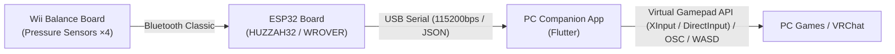

# BalanceBoard-Gamepad 🎮

[English](README.en.md) | [日本語](README.md)

A motion-sensing analog gamepad project that turns the Wii Balance Board into a PC gamepad using an ESP32 board (Adafruit HUZZAH32, Freenove ESP32-WROVER, etc.) and a **PC background companion app (Flutter)**.

Values from the four weight/pressure sensors located at the corners of the Wii Balance Board are read by the ESP32 and transmitted via USB serial communication to the PC companion app. The app translates these inputs into a virtual gamepad (analog input), OSC messages, or WASD keyboard controls for PC games.

---

## 🏗 System Architecture



---

## ✨ Features

- **Motion-Sensing Analog Control**: Maps weight shift (forward/backward/left/right/center of gravity) on the Wii Balance Board to gamepad analog stick inputs (X/Y axes).
- **Easy Build & Flash (PlatformIO + Make)**: Manage firmware development with simple Make commands like `make build` and `make upload`.
- **PC Background Companion App**: Runs in the system tray/menu bar, translating real-time sensor data to gamepad inputs, OSC messages (VRChat support), or WASD keyboard emulation. Offers a visual GUI for weight/center-of-gravity monitoring, deadzone, sensitivity, and calibration settings.

---

## 🔌 Required Hardware & Components

| Device / Component | Description / Notes |
| :--- | :--- |
| **Wii Balance Board** | Nintendo Wii Balance Board |
| **ESP32 Development Board** | ESP32 board supporting Bluetooth Classic<br>- Adafruit HUZZAH32 / Feather ESP32 (`featheresp32`)<br>- Freenove ESP32-WROVER Dev Board (FNK0090) (`freenove_esp32_wrover`) |
| **USB Cable** | USB cable for power and serial communication between ESP32 and PC |


---

## 🛠 Development & Environment

- **Firmware**: [PlatformIO Core (CLI)](https://docs.platformio.org/) / `make`
- **PC Companion App**: [Flutter](https://flutter.dev/) (macOS / Windows / Linux Desktop)

---

## 🚀 Quick Start (Build & Flash Firmware)

### 1. Clone Repository
```bash
git clone https://github.com/.../BalanceBoard-Gamepad.git
cd BalanceBoard-Gamepad/Firmware
```

### 2. Firmware Operations (Make Commands)

Run the following commands inside the [Firmware](./Firmware/README.md) directory:

```bash
# Build firmware
make build

# Flash firmware to ESP32
make upload

# Start serial monitor
make monitor

# Clean build artifacts
make clean
```

---

## 📦 App Release & Executable Build (GitHub Actions)

Pushing a tag (e.g., `v1.0.0`) to GitHub triggers the GitHub Actions workflow automatically, building release archives (`.zip`) for **macOS** and **Windows** attached to the GitHub Release.

### Creating and Pushing a Tag

```bash
# 1. Create a release tag (e.g., v1.0.0)
git tag v1.0.0

# 2. Push tag to GitHub
git push origin v1.0.0

# 3. Re-push a tag (if deleting and recreating)
git tag -d <tag_name>
git push origin :refs/tags/<tag_name>
git tag <tag_name>
git push origin <tag_name>
```

> [!TIP]
> After pushing a tag, download executables for macOS (`balance_board_app-macos.zip`) and Windows (`balance_board_app-windows.zip`) directly from the **Releases** page on GitHub.

---

## 📁 Repository Structure

```text
BalanceBoard-Gamepad/
├── README.md               # Japanese documentation
├── README.en.md            # English documentation (This document)
├── Firmware/               # ESP32 firmware
│   ├── Makefile            # Makefile for PlatformIO operations
│   ├── README.md           # Firmware details documentation
│   └── ...
├── App/                    # PC background companion app (Flutter)
│   ├── README.md           # Companion app details documentation
│   └── ...
├── Casing/                 # 3D printable case design files (OpenSCAD / STL)
│   ├── README.md           # Case specifications & print guidelines
│   └── ...
├── Assets/                 # Project media assets (Photos, UI screenshots, Logos)
│   └── README.md           # Assets management guidelines
└── Shop/                   # Store listing assets & distribution information
    ├── README.md           # Store overview
    └── ...
```

- For detailed component documentation, refer to the [Firmware README](./Firmware/README.md), [App README](./App/README.md), [Casing README](./Casing/README.md), [Assets README](./Assets/README.md), and [Shop README](./Shop/README.md).

---

## 📄 License

MIT License
