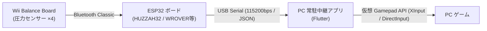

# BalanceBoard-Gamepad 🎮

[English](README.en.md) | [日本語](README.md)

Wii Balance Board と ESP32 ボード (Adafruit HUZZAH32 / Freenove ESP32-WROVER 等)、および **PC 常駐中継アプリ (Flutter)** を使用した、体感型アナログゲームパッド化プロジェクトです。

Wii Balance Board の4隅に搭載されている圧力・重量センサーの値を ESP32 で取得し、USB シリアル通信経由で PC の常駐中継アプリへ送信。常駐中継アプリが PC ゲーム向けの仮想ゲームパッド（アナログ入力）として認識・入力中継します。

---

## 🏗 システムアーキテクチャ



---

## ✨ 特長・機能

- **体感型アナログ制御**: Wii Balance Board 上での体重移動（前・後・左・右・重心位置）をゲームパッドのアナログ入力（X/Y軸等）にマッピング。
- **簡単ビルド・書き込み (PlatformIO + Make)**: `make build` や `make upload` などのシンプルな Make コマンドでファームウェアの開発・管理が可能。
- **PC 常駐中継アプリ連携**: タスクトレイに常駐し、リアルタイムでゲームパッド入力へ中継。重心モニタリング、感度・デッドゾーン・キャリブレーションの調整を GUI で実施可能。

---

## 🔌 必要デバイス & ハードウェア

| デバイス / コンポーネント | 概要 / 入手先目安 |
| :--- | :--- |
| **Wii Balance Board** | 任天堂 Wii 用バランスボード（中古店等で約1,000円〜入手可能） |
| **ESP32 開発ボード** | Bluetooth Classic 対応の ESP32 ボード<br>・Adafruit HUZZAH32 / Feather ESP32 (`featheresp32`)<br>・Freenove ESP32-WROVER Dev Board (FNK0090) (`freenove_esp32_wrover`) |
| **USB ケーブル** | ESP32 と PC 接続・給電用ケーブル |


---

## 🛠 開発・動作環境

- **ファームウェア**: [PlatformIO Core (CLI)](https://docs.platformio.org/) / `make`
- **PC 常駐中継アプリ**: [Flutter](https://flutter.dev/) (macOS / Windows / Linux デスクトップ対応)

---

## 🚀 クイックスタート (ファームウェアのビルド & 書き込み)

### 1. リポジトリのクローン
```bash
git clone https://github.com/.../BalanceBoard-Gamepad.git
cd BalanceBoard-Gamepad/Firmware
```

### 2. ファームウェアの操作 (Make コマンド)

[Firmware](./Firmware/README.md) ディレクトリ内で以下のコマンドを実行します：

```bash
# ファームウェアのビルド
make build

# ESP32 への書き込み
make upload

# シリアルモニタの起動
make monitor

# ビルド成果物の削除
make clean
```


---

## 📦 アプリのリリースと実行ファイルのビルド (GitHub Actions)

GitHub にタグ（例: `v1.0.0`）をプッシュすると、GitHub Actions ワークフローが自動起動し、**macOS** および **Windows** 向けの実行ファイル（`.zip`）が作成されて GitHub Release に添付されます。

### タグの作成とプッシュ手順

```bash
# 1. リリースタグを作成 (例: v1.0.0)
git tag v1.0.0

# 2. タグを GitHub にプッシュ
git push origin v1.0.0

# 3. タグを再プッシュ（例: タグを削除して打ち直す場合）
git tag -d <タグ名>
git push origin :refs/tags/<タグ名>
git tag <タグ名>
git push origin <タグ名>
```

> [!TIP]
> タグをプッシュ後、GitHub リポジトリの **Releases** ページから macOS 用 (`balance_board_app-macos.zip`) および Windows 用 (`balance_board_app-windows.zip`) の実行ファイルをダウンロードできます。

---

## 📁 リポジトリ構造

```text
BalanceBoard-Gamepad/
├── README.md               # 本ドキュメント (日本語)
├── README.en.md            # 英語版ドキュメント
├── Firmware/               # ESP32 用ファームウェア
│   ├── Makefile            # PlatformIO 操作用 Makefile
│   ├── README.md           # ファームウェア詳細ドキュメント
│   └── ...
└── App/                    # PC常駐中継アプリケーション (Flutter)
    ├── README.md           # 常駐中継アプリ詳細ドキュメント
    └── ...
```

- 各コンポーネントの詳細は [ファームウェア README](./Firmware/README.md) および [常駐中継アプリ README](./App/README.md) を参照してください。

---

## 📄 ライセンス

MIT License
